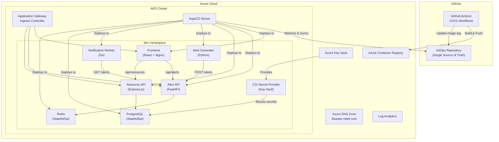
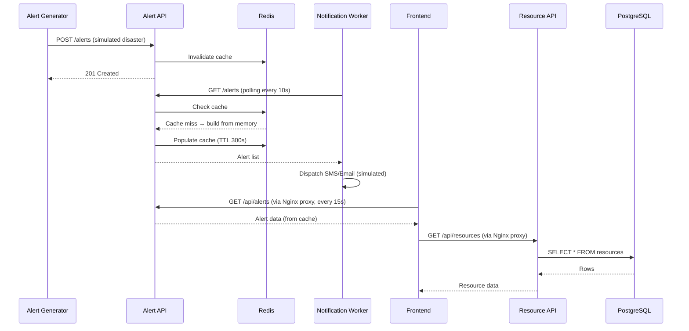
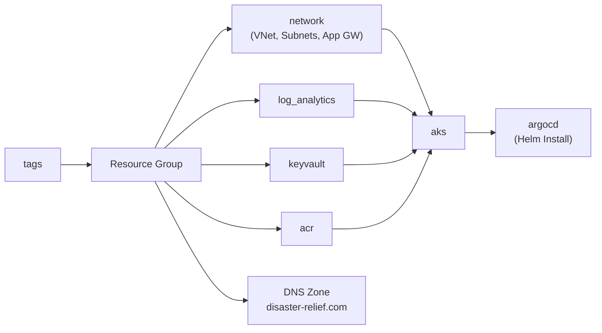
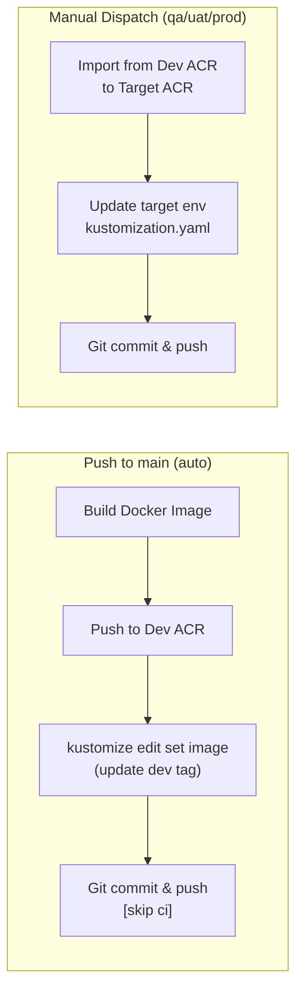
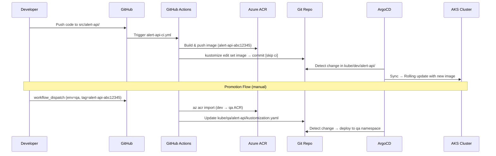
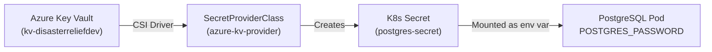

# Disaster Relief Platform — Complete Project Architecture

A **GitOps-driven, cloud-native microservices platform** for simulating real-time disaster relief coordination. Deployed on **Azure AKS** with **ArgoCD** for continuous delivery, **Terraform** for infrastructure-as-code, and **GitHub Actions** for CI/CD.

---

## High-Level Architecture



---

## 1. Microservices (`src/`)

The platform consists of **5 microservices**, each containerized with its own Dockerfile and written in a different technology:

| Service | Tech Stack | Port | Role | Data Store |
|---|---|---|---|---|
| [alert-api](file:///d:/Projects%20-%20ArgoCD/src/alert-api/main.py) | Python / FastAPI | 8000 | Core API — ingests & serves emergency alerts | Redis (cache), in-memory list |
| [alert-generator](file:///d:/Projects%20-%20ArgoCD/src/alert-generator/main.py) | Python | — | CronJob — generates simulated disaster alerts (earthquakes, floods, wildfires, etc.) and POSTs them to alert-api | None |
| [resource-api](file:///d:/Projects%20-%20ArgoCD/src/resource-api/index.js) | Node.js / Express | 3000 | CRUD API for managing relief supply inventories | PostgreSQL |
| [notification-worker](file:///d:/Projects%20-%20ArgoCD/src/notification-worker/main.go) | Go | — | Long-running worker — polls alert-api and simulates SMS/Email dispatch for new alerts | None |
| [frontend](file:///d:/Projects%20-%20ArgoCD/src/frontend/src/App.js) | React (CRA) + Nginx | 80 | Dashboard UI — displays active alerts and resource inventory in real-time | None (calls APIs) |

### Data Flow



### Frontend Routing (Nginx Reverse Proxy)

The React frontend is served through [nginx.conf](file:///d:/Projects%20-%20ArgoCD/src/frontend/nginx.conf) which acts as a reverse proxy:

| Path | Backend | Description |
|---|---|---|
| `/` | Static React build | SPA with fallback to `index.html` |
| `/api/alerts` | `alert-api-service:8000/alerts` | Proxied to Alert API |
| `/api/resources` | `resource-api-service:3000/resources` | Proxied to Resource API |
| `/healthz` | Returns `200 ok` | Health check endpoint |

---

## 2. Infrastructure-as-Code (`infrastructure/`)

All Azure infrastructure is provisioned via **Terraform** with modular design:

### Module Dependency Chain



### Terraform Modules (`infrastructure/modules/`)

| Module | Purpose |
|---|---|
| [tag](file:///d:/Projects%20-%20ArgoCD/infrastructure/modules/tag) | Generates consistent resource tags (environment, project, owner, cost center) |
| [network](file:///d:/Projects%20-%20ArgoCD/infrastructure/modules/network) | VNet, app subnets, DB subnets, Application Gateway subnet + gateway |
| [log_analytics](file:///d:/Projects%20-%20ArgoCD/infrastructure/modules/log_analytics) | Azure Log Analytics workspace for monitoring |
| [keyvault](file:///d:/Projects%20-%20ArgoCD/infrastructure/modules/keyvault) | Azure Key Vault with network ACLs (subnet + IP whitelisting) |
| [acr](file:///d:/Projects%20-%20ArgoCD/infrastructure/modules/acr) | Azure Container Registry for Docker images |
| [aks](file:///d:/Projects%20-%20ArgoCD/infrastructure/modules/aks) | AKS cluster with AGIC addon, ACR integration, Key Vault CSI, OIDC |
| [argocd](file:///d:/Projects%20-%20ArgoCD/infrastructure/modules/argocd) | ArgoCD Helm chart deployment with AGIC and KV integration |

### Environment Configurations (`infrastructure/environments/`)

| File | Environment | Node Size | Nodes |
|---|---|---|---|
| [dev.tfvars](file:///d:/Projects%20-%20ArgoCD/infrastructure/environments/dev.tfvars) | dev | Standard_D2s_v3 | 2 |
| [qa.tfvars](file:///d:/Projects%20-%20ArgoCD/infrastructure/environments/qa.tfvars) | qa | Standard_D2s_v3 | 2 |
| [uat.tfvars](file:///d:/Projects%20-%20ArgoCD/infrastructure/environments/uat.tfvars) | uat | Standard_D2s_v3 | 2 |
| [prod.tfvars](file:///d:/Projects%20-%20ArgoCD/infrastructure/environments/prod.tfvars) | prod | Standard_D2s_v3 | 2 |

### Backend Configuration

- **Remote State**: Azure Blob Storage (`tfstate-rg` / `disasterrelieftfstate123` / `tfstate`)
- **Dynamic State Keys**: Each environment uses `{env}.tfstate` via `-backend-config="key=${ENV_NAME}.tfstate"`
- **Providers**: `azurerm ~> 3.90`, `kubernetes ~> 2.24`, `helm ~> 2.11`

---

## 3. Kubernetes Manifests (`kube/`)

Uses **Kustomize** with a **base + overlay** pattern for environment-specific configurations:

```
kube/
├── argocd-server/
│   └── argocd-ingress.yaml          # ArgoCD UI at argocd.disaster-relief.com
├── base/                             # Shared manifests (environment-agnostic)
│   ├── alert-api/                    # Deployment + Ingress + Service
│   ├── alert-generator/              # CronJob
│   ├── frontend/                     # Deployment + Ingress + Service (2 replicas)
│   ├── notification-worker/          # Deployment
│   ├── postgressql/                  # StatefulSet + Headless Service (5Gi PVC)
│   ├── redis/                        # StatefulSet + Headless Service (1Gi PVC)
│   └── resource-api/                 # Deployment + Ingress + Service
├── dev/                              # Dev environment overlay
│   ├── common/                       # Shared dev resources
│   │   ├── namespace.yaml            # dev namespace
│   │   ├── secret-provider.yaml      # Azure KV CSI SecretProviderClass
│   │   └── kustomization.yaml
│   ├── alert-api/kustomization.yaml  # Patches DNS to dev-alerts.disaster-relief.com
│   ├── frontend/kustomization.yaml
│   ├── resource-api/kustomization.yaml
│   ├── alert-generator/kustomization.yaml
│   ├── notification-worker/kustomization.yaml
│   ├── postgressql/kustomization.yaml
│   └── redis/kustomization.yaml
└── ingress-controller.yaml
```

### Key Design Patterns

| Pattern | Details |
|---|---|
| **Kustomize Base/Overlay** | Base defines generic K8s resources; `dev/` overlay patches DNS hostnames and image tags |
| **Common Resources** | `dev/common/` provides namespace + Azure Key Vault `SecretProviderClass` shared by all components |
| **DNS Patching** | Each overlay uses JSON patches to set environment-specific hostnames (e.g., `dev-alerts.disaster-relief.com`) |
| **Image Tags** | Managed via `kustomize edit set image` — CI updates the `newTag` field in each overlay's `kustomization.yaml` |
| **Stateful Data** | PostgreSQL (5Gi) and Redis (1Gi) use `StatefulSet` + `PersistentVolumeClaims` |
| **Secrets via CSI** | PostgreSQL password sourced from Azure Key Vault via the Secrets Store CSI driver |
| **Ingress** | Azure Application Gateway Ingress Controller (AGIC) with TLS termination |

---

## 4. ArgoCD Applications (`argocd/`)

Each service has a dedicated ArgoCD `Application` CR that watches a specific Kustomize overlay path:

| Application | [Source Path](file:///d:/Projects%20-%20ArgoCD/argocd/dev) | Target Namespace |
|---|---|---|
| [alert-api-dev](file:///d:/Projects%20-%20ArgoCD/argocd/dev/alert-api-dev.yaml) | `kube/dev/alert-api/` | `dev` |
| [alert-generator-dev](file:///d:/Projects%20-%20ArgoCD/argocd/dev/alert-generator-dev.yaml) | `kube/dev/alert-generator/` | `dev` |
| [frontend-dev](file:///d:/Projects%20-%20ArgoCD/argocd/dev/frontend-dev.yaml) | `kube/dev/frontend/` | `dev` |
| [notification-worker-dev](file:///d:/Projects%20-%20ArgoCD/argocd/dev/notification-worker-dev.yaml) | `kube/dev/notification-worker/` | `dev` |
| [postgres-dev](file:///d:/Projects%20-%20ArgoCD/argocd/dev/postgressql-dev.yaml) | `kube/dev/postgressql/` | `dev` |
| [redis-dev](file:///d:/Projects%20-%20ArgoCD/argocd/dev/redis-dev.yaml) | `kube/dev/redis/` | `dev` |
| [resource-api-dev](file:///d:/Projects%20-%20ArgoCD/argocd/dev/resource-api-dev.yaml) | `kube/dev/resource-api/` | `dev` |

### Sync Policy
- **Automated sync** with `prune: true` and `selfHeal: true`
- ArgoCD watches the `main` branch of `ciphernerd11/gitops-aks-microservices.git`
- Any commit to `kube/dev/<service>/` triggers automatic rollout

---

## 5. CI/CD Pipelines (`.github/`)

### Service Workflows (5 pipelines)

Each microservice has an identical workflow structure:



| Workflow | Trigger | Service |
|---|---|---|
| [alert-api-ci.yml](file:///d:/Projects%20-%20ArgoCD/.github/workflows/alert-api-ci.yml) | Push to `src/alert-api/**` or `kube/dev/alert-api/**` | alert-api |
| [alert-generator-ci.yml](file:///d:/Projects%20-%20ArgoCD/.github/workflows/alert-generator-ci.yml) | Push to `src/alert-generator/**` | alert-generator |
| [frontend-ci.yml](file:///d:/Projects%20-%20ArgoCD/.github/workflows/frontend-ci.yml) | Push to `src/frontend/**` | frontend |
| [notification-worker-ci.yml](file:///d:/Projects%20-%20ArgoCD/.github/workflows/notification-worker-ci.yml) | Push to `src/notification-worker/**` | notification-worker |
| [resource-api-ci.yml](file:///d:/Projects%20-%20ArgoCD/.github/workflows/resource-api-ci.yml) | Push to `src/resource-api/**` | resource-api |

**Image Tag Format**: `{service-name}-{short-SHA}` (e.g., `alert-api-515942ef`)

### Composite Action: [promote-image](file:///d:/Projects%20-%20ArgoCD/.github/actions/promote-image/action.yml)

Reusable action for **image promotion across environments**:
1. Verifies Azure login
2. Uses `az acr import` to copy image from Dev ACR to target environment's ACR
3. Runs `kustomize edit set image` to update the target overlay's kustomization.yaml

### Infrastructure Workflows

| Workflow | Purpose |
|---|---|
| [terraform-ci.yml](file:///d:/Projects%20-%20ArgoCD/.github/workflows/terraform-ci.yml) | Terraform Plan (on PR) + Apply (on manual dispatch) with Key Vault IP whitelisting |
| [terraform-destroy.yml](file:///d:/Projects%20-%20ArgoCD/.github/workflows/terraform-destroy.yml) | Terraform Destroy for tearing down environments |

---

## 6. GitOps Flow (End-to-End)



---

## 7. Networking & Ingress

| Endpoint | Backend | Notes |
|---|---|---|
| `disaster-relief.com/` | Frontend (port 80) | Main dashboard |
| `disaster-relief.com/api/alerts` | Alert API (port 8000) | REST API |
| `disaster-relief.com/api/resources` | Resource API (port 3000) | REST API |
| `dev-alerts.disaster-relief.com/api/alerts` | Alert API (dev overlay) | Dev-specific DNS |
| `argocd.disaster-relief.com/` | ArgoCD Server (port 80) | ArgoCD UI |

All ingress uses **Azure Application Gateway Ingress Controller (AGIC)** with TLS.

---

## 8. Secret Management



- **Azure Key Vault** stores sensitive values (e.g., `postgres-password`)
- **Secrets Store CSI Driver** with `useVMManagedIdentity: true` syncs secrets into K8s
- `SecretProviderClass` defined in `kube/dev/common/secret-provider.yaml`

---

## 9. Directory Structure Summary

```
gitops-aks-microservices/
├── .github/
│   ├── actions/promote-image/       # Reusable composite action for image promotion
│   └── workflows/                   # 7 CI/CD workflows (5 services + 2 infra)
├── argocd/
│   └── dev/                         # 7 ArgoCD Application CRs for dev environment
├── docs/                            # Architecture docs, deployment guide, walkthrough
├── infrastructure/
│   ├── environments/                # 4 env-specific tfvars (dev, qa, uat, prod)
│   ├── modules/                     # 7 Terraform modules (acr, aks, argocd, keyvault, log_analytics, network, tag)
│   ├── main.tf                      # Provider config + backend
│   ├── resources.tf                 # Module wiring & resource group
│   ├── variables.tf                 # Input variables
│   ├── outputs.tf                   # Outputs (RG name, ACR login, AKS cluster name)
│   └── dns.tf                       # DNS zone (disaster-relief.com)
├── kube/
│   ├── argocd-server/               # ArgoCD ingress
│   ├── base/                        # 7 base K8s manifests (Deployments, StatefulSets, Services, Ingresses)
│   └── dev/                         # Dev overlay (Kustomize patches for DNS, image tags, common resources)
├── src/
│   ├── alert-api/                   # Python/FastAPI (+ Redis cache)
│   ├── alert-generator/             # Python script (simulated disasters)
│   ├── frontend/                    # React + Nginx reverse proxy
│   ├── notification-worker/         # Go (polling + simulated dispatch)
│   └── resource-api/                # Node.js/Express (+ PostgreSQL)
└── monitoring/                      # (empty — future use)
```

---

## 10. Current Status & Observations

> [!NOTE]
> This is a read-only analysis of the existing project structure. No code changes are proposed.

### What's Working
- ✅ Full GitOps pipeline with ArgoCD auto-sync (prune + self-heal)
- ✅ Multi-service CI/CD with per-service path-based triggers
- ✅ Image promotion workflow across environments (dev → qa → uat → prod)
- ✅ Kustomize base/overlay pattern for environment isolation
- ✅ Azure Key Vault integration via CSI driver for secret management
- ✅ Terraform IaC with remote state and environment-specific configurations
- ✅ AGIC-based ingress with TLS termination

### Environments Status
- ✅ **dev**: Fully configured (ArgoCD apps, Kustomize overlays, namespace, secrets)
- ⬜ **qa/uat/prod**: Environment tfvars exist but Kustomize overlays and ArgoCD apps are not yet created (promotion action references them but `kube/qa/`, `kube/uat/`, `kube/prod/` directories don't exist yet)

### Areas for Future Work
- `monitoring/` directory is empty — Prometheus/Grafana setup pending
- Only `dev` environment has ArgoCD applications and Kustomize overlays
- No automated tests in any microservice
- `alert-api` uses in-memory storage (not a database)
- `alert-generator` runs once per execution (would need a K8s CronJob schedule)
